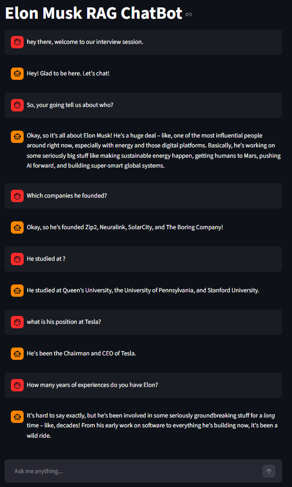

# Resume RAG Chatbot

Chat with any resume using LLMs + RAG.

This project allows you to upload any resume (PDF) and ask questions about it — just like ChatGPT.



---

## Features

* Load and process PDF resumes
* Semantic search with embeddings (ChromaDB)
* LLM-powered answers using Ollama (Gemma / LLaMA / etc.)
* Chat-style UI with Streamlit
* Context-aware responses (RAG)

---

## Tech Stack

* LangChain
* LangGraph
* Ollama
* ChromaDB
* Streamlit
* HuggingFace Embeddings

---

## Project Structure

```
.
├── data/                # Your PDF files
├── chroma_db/           # Vector database
├── create_db.py         # Build vector DB
├── rag_graph.py         # RAG logic (LangGraph)
├── main.py              # Streamlit UI
└── requirements.txt
```

---

How it works
* Upload any resume (PDF) in ```data``` folder
* The app splits it into chunks
* Embeddings are created and stored in a vector DB
* You can chat with your resume using natural language

## Setup

### 1. Clone repo

```
git clone https://github.com/MohammadHeydari/Resume-RAG-Chatbot.git
cd resume-rag-chatbot
```

### 2. Create virtual environment

```
python -m venv .venv
source .venv/bin/activate   # Linux/Mac
.venv\Scripts\activate      # Windows
```

### 3. Install dependencies

```
pip install -r requirements.txt
```

### 4. Run Ollama

Make sure Ollama is running:

```
ollama run gemma3:4b
```

---

## Add your favourite resume

Put your PDF inside:

```
data/your_resume.pdf
```

Then build the database:

```
python create_db.py
```

---

Test the RAG Pipeline (Optional):
You can test the backend without UI:

```
python rag_graph.py
```
This runs a simple CLI test to verify retrieval + generation works correctly.

---

## Run the app

```
streamlit run main.py
```

---

## Example Questions

* "What is your experience?"
* "What did your study?"
* "What are your skills?"

---

## Use Case

* Personal AI assistant for any resume
* Interview preparation
* Portfolio project

---

## Notes

* Make sure Ollama is running locally
* Works best with clean PDF resumes

---

## Future Improvements

* Streaming responses (like ChatGPT)
* Multi-document support
* Better memory handling
* Deployment (Docker / Cloud)

---

## Star the repo if you like it :-)
